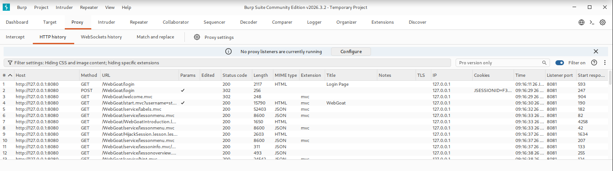
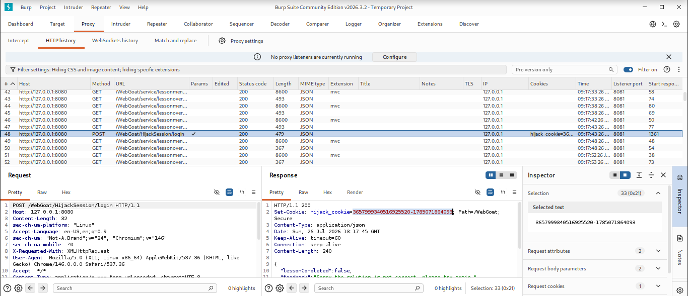
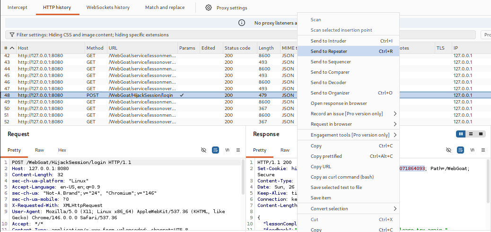
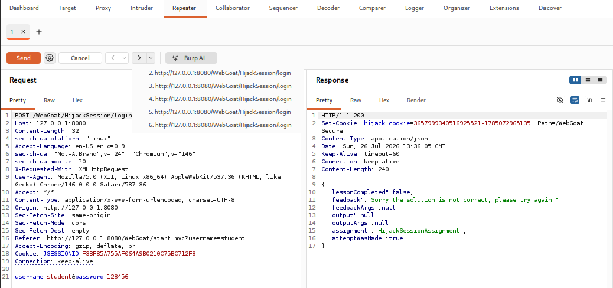
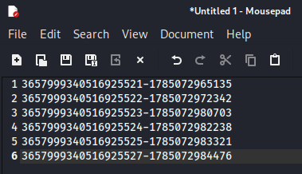
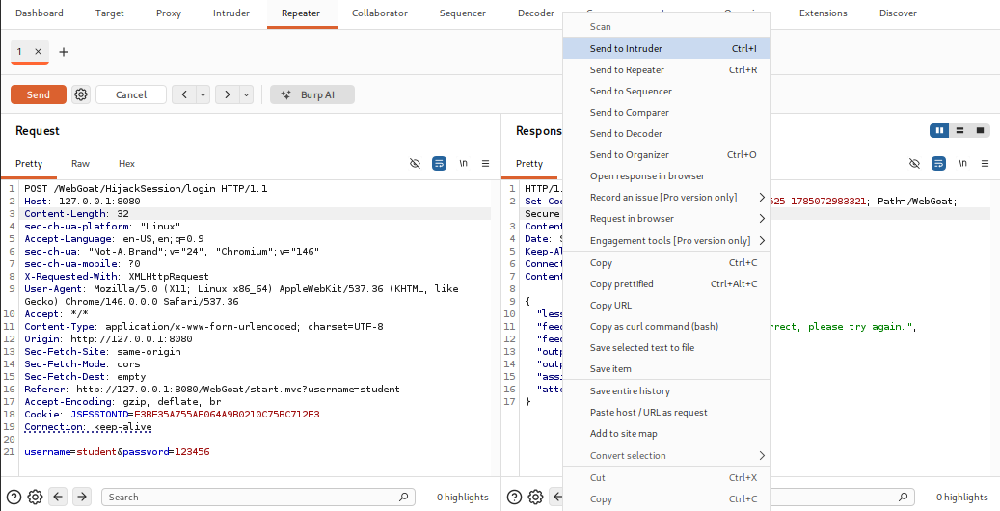
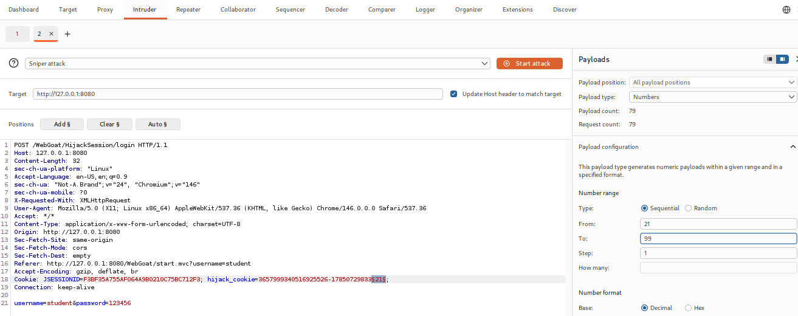
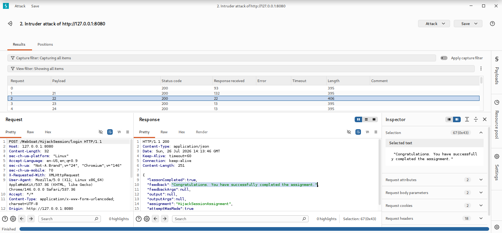
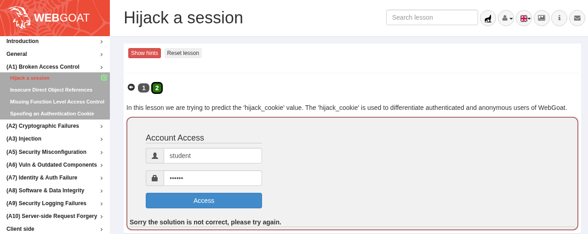

## Мета: Знайомство з A01:2025 Broken Access Control

### Середовище: Kali Linux, Docker engine, OWASP WebGoat container.

### Для кращого розуміння потрібно пройти попередні кроки з мануала WebGoat

В меню обираємо:


Предивляємось постановку завдання:

### Концепція
Розробники прикладного програмного забезпечення, які створюють власні ідентифікатори сесій (session IDs), часто забувають забезпечити рівень складності та рандомізації, необхідний для безпеки. Якщо специфічний ідентифікатор сесії користувача не є складним і випадковим, додаток стає надзвичайно вразливим до атак типу «brute force» (перебір) на сесії.

### Цілі
Отримати доступ до автентифікованої сесії, що належить іншому користувачу.

---

### Основні терміни:
* **Session ID** — ідентифікатор сесії.
* **Complexity and randomness** — складність та випадковість.
* **Brute force attacks** — атаки методом грубої сили (перебору).
* **Authenticated session** — автентифікована сесія (сеанс).

### Далі переходимо на другу вкладинку (червоний колір означає, що потрібно буде щось зробити і це буде перевірятись)


### У цьому уроці ми намагаємося передбачити значення «hijack_cookie». Файл «hijack_cookie» використовується для розрізнення автентифікованих та анонімних користувачів WebGoat.

Спробуємо дослідити за допомогою Burpsuit. Запускаємо його, переходимо на вкладинку "Proxy", запускаємо браузер, в якому відкриваємо "WebGoat" та створюємо користавача і логінуємся або одразу логінуємось (якщо не видаляли контейнер) та переходимо на другий крок:

натискаємо "Access", отримуємо помилку та повертаємось до **burpsuit**, де маємо передивитись вкладинку **HTTPhistory**:

Далі шукаємо відповідь **POST**, в якої міститься інформація про цю помилку (ключ - це зміст **hijack_cookie**, яку нам і потрібно "передбачити"):

Далі натискаємо праву кнопку миші та відправляємо запит до **Repeater**:

В **Repeater** робимо декілька повторів (в цьому прикладі може вистачити 5+ запитів):

та бачимо, як змінюється значення **hijack_cookie**, копіюємо ці значення в текстовий редактор:

Навіть поверхневий аналіз дає висновок про логіку створення кукі, перша частина відповідає за сесію користувача, а друга скоріш за все є **часовою міткою**, або **timestamp**.
```sh
3657999340516925521-1785072965135
3657999340516925522-1785072972342
3657999340516925523-1785072980703
3657999340516925524-1785072982238
3657999340516925525-1785072983321
3657999340516925527-1785072984476
```
Бачимо, що між 3657999340516925525 та 3657999340516925527 може бути сесія 3657999340516925526.
Передаємо запит з сесією 3657999340516925525 до **intruder**:



Далі в **Intruder** формуємо свій запит відповідним чином:
- додаємо **hijack_cookie** `3657999340516925526-1785072983321`, останні дві цифри будемо змінювати, такий собі лайтовий брутфорс


Запускаємо **start attack** та чекаємо результатів перебору, однак майже одразу отримуємо позитивний результат:


Та відповідно в завданні вкладинка змінює колір з червоного на зелений:


Вітання, завдання пройдено!


